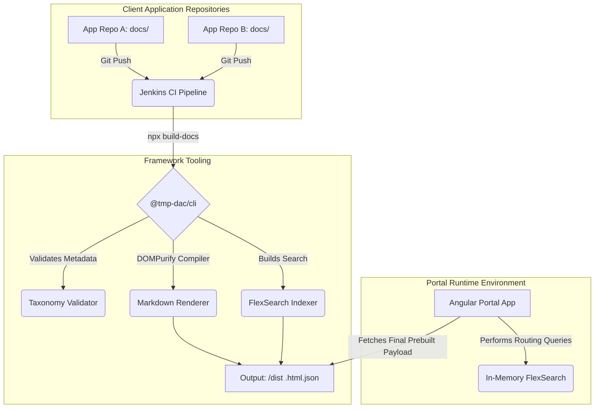
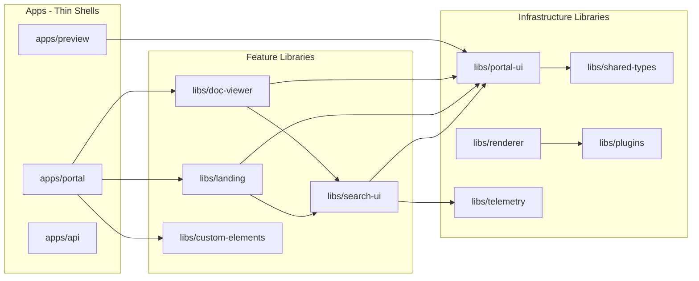

# Platform Architecture

Our enterprise documentation platform acts as an aggregation engine composed of several disjoint micro-services working together to convert disparate Markdown repositories into a cohesive internal Knowledge Base.

## High Level Data Flow

## Library Architecture

The front-end follows an Nx monorepo structure where feature code lives in shared libraries and applications are thin shells:

### Feature Libraries

| Library | Import Path | Responsibility |
|---------|------------|----------------|
| `libs/doc-viewer` | `@tmp-dac/doc-viewer` | Document rendering page with TOC, sidebar navigation, mermaid diagrams |
| `libs/landing` | `@tmp-dac/landing` | Landing page with taxonomy navigation and product catalog cards |
| `libs/search-ui` | `@tmp-dac/search-ui` | Command palette search modal (⌘K) powered by FlexSearch |
| `libs/custom-elements` | `@tmp-dac/custom-elements` | Web Components: `<dac-copy-button>`, `<dac-content-tabs>` |

### Infrastructure Libraries

| Library | Import Path | Responsibility |
|---------|------------|----------------|
| `libs/portal-ui` | `@tmp-dac/portal-ui` | Shared services (EnvironmentService, SearchService), directives (SafeHtmlDirective) |
| `libs/shared-types` | `@tmp-dac/shared-types` | TypeScript interfaces (DocumentNode, etc.) shared across all libs |
| `libs/renderer` | `@tmp-dac/renderer` | Markdown→HTML compiler using Marked.js + DOMPurify + Shiki |
| `libs/plugins` | `@tmp-dac/plugins` | Renderer plugins: Mermaid, TOC extraction, content tabs pre-processor |
| `libs/telemetry` | `@tmp-dac/telemetry` | Page view tracking, search analytics, feedback collection |

### Applications

1. **apps/portal:** Angular 19 SPA — a thin routing shell that imports feature libraries. Handles theme detection, telemetry setup, and custom element registration.
2. **apps/preview:** Standalone local preview tool for authors to render markdown locally without the backend API.
3. **apps/api:** NestJS REST backend — discovers and serves pre-built HTML/JSON payloads and catalog tree structure.

## Angular Patterns

The front-end uses modern Angular idioms:

- **Signals** for all reactive state (`signal()`, `computed()`, `toSignal()`)
- **`@if`/`@for`** control flow (no `*ngIf`/`*ngFor`)
- **`takeUntilDestroyed()`** for automatic subscription cleanup
- **`fromEvent()`** for DOM event handling (no `@HostListener`)
- **Standalone components** — no `NgModule` anywhere
- **`SafeHtmlDirective`** for injecting pre-sanitized HTML (no `bypassSecurityTrustHtml()` calls)
- **Web Components** (`@angular/elements`) for runtime-injected custom elements
