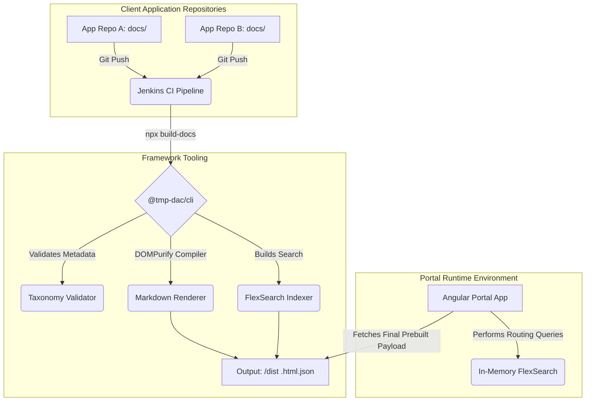

# Platform Architecture

Our enterprise documentation platform acts as an aggregation engine composed of several disjoint micro-services working together to convert disparate Markdown repositories into a cohesive internal Knowledge Base.

## High Level Data Flow

### Components

1. **libs/cli:** The core overarching command-line engine that physically runs within the Jenkins PR validation job. It enforces the metadata schema mapping rules and statically pre-generates the HTML JSON payloads required by the Frontend.
2. **libs/renderer:** A hardened Markdown parser wrapping `DOMPurify` and `marked.js` to compile standard markdown, tightly protect against XSS execution, and initialize rendering hooks for plugins like Mermaid diagrams.
3. **apps/api:** The NestJS REST endpoint controller acting as the generic proxy that dynamically discovers underlying pre-built directory structures for the Angular clients.
4. **apps/portal:** The Angular 17+ single-page-application responsible for the presentation layer, visual syntax highlighting, searching, and structural UI layout.
