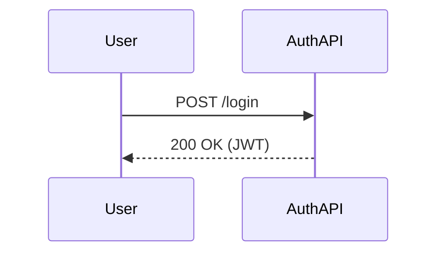

# Authoring Guide

Writing documentation for the Docs-as-Code platform is exactly like writing code. You check out the repository, spin up your editor, and author standard Markdown.

## Setting up your Document Site

Each nested directory holding technical documentation must contain a `docs.yaml` manifest file at its root. This defines its identity within the global enterprise taxonomy.

```yaml
title: System Overview
description: High level components for the authentication module.
domain: security
system: identity-access
product: auth-api
owner: team-auth@acme.corp
version: v2.1.0
```

## Markdown Features

We support standard GitHub Flavored Markdown (GFM), including:
- **Headings** `#`, `##` (which automatically generate the Table of Contents)
- **Bold/Italics** `**bold**`, `*italics*`
- **Lists** `- item` or `1. item`

### Code Blocks

Code snippets will be highlighted correctly based on their language tag:

```typescript
export function helloWorld() {
  console.log("Hello Docs!");
}
```

### Diagrams

We deeply integrate with Mermaid.js. Simply use the `mermaid` language tag:



### Local Images

You can place images directly beside your `.md` files and link them naturally.

``

The CLI compiler will automatically detect binary formats (PNG, JPG, SVG) and aggressively bundle them into the static site payload alongside your text!
