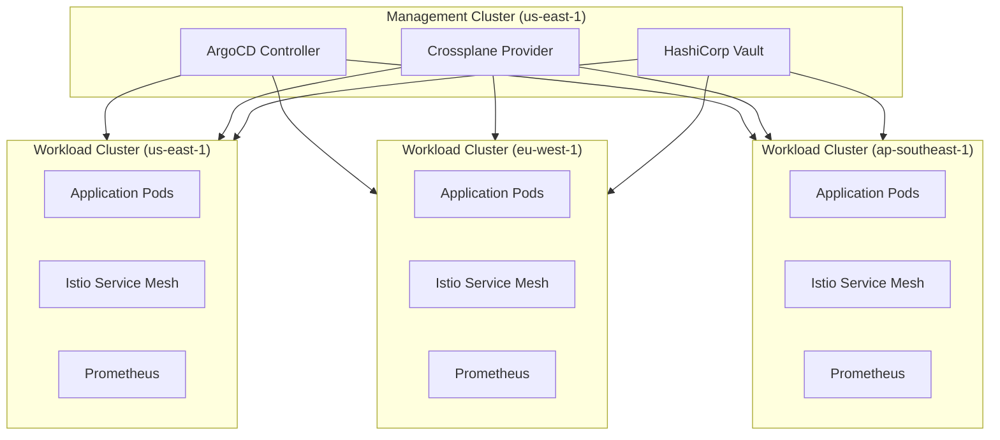
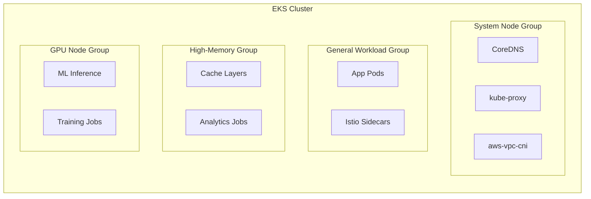
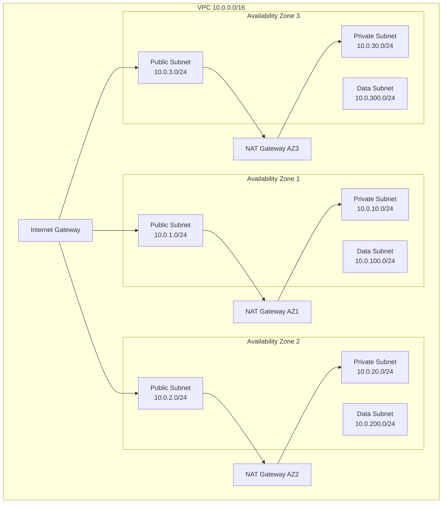
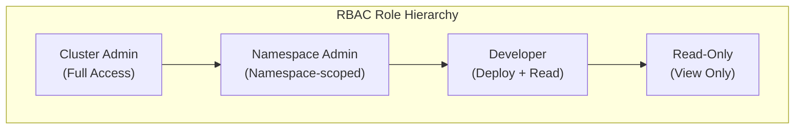
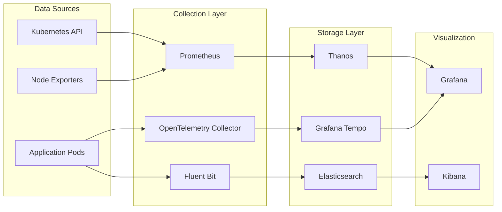
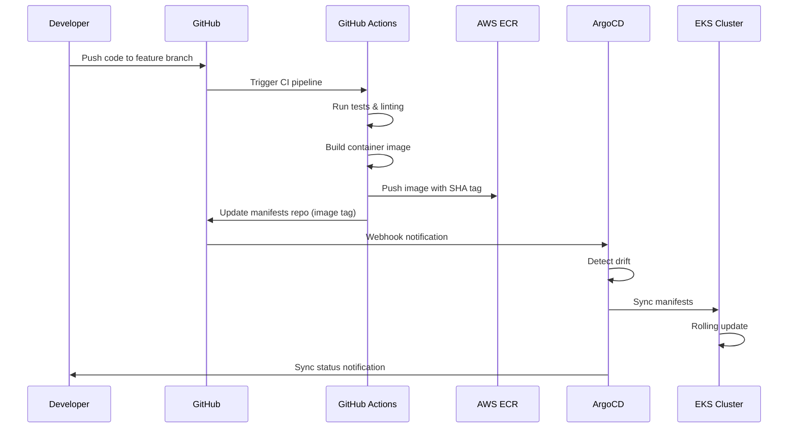
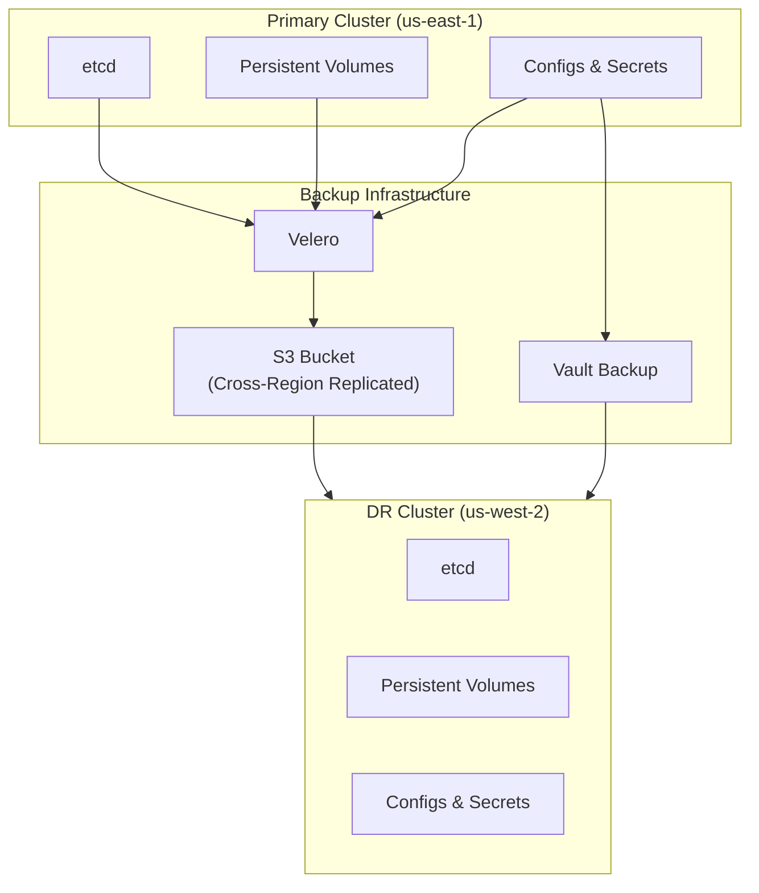
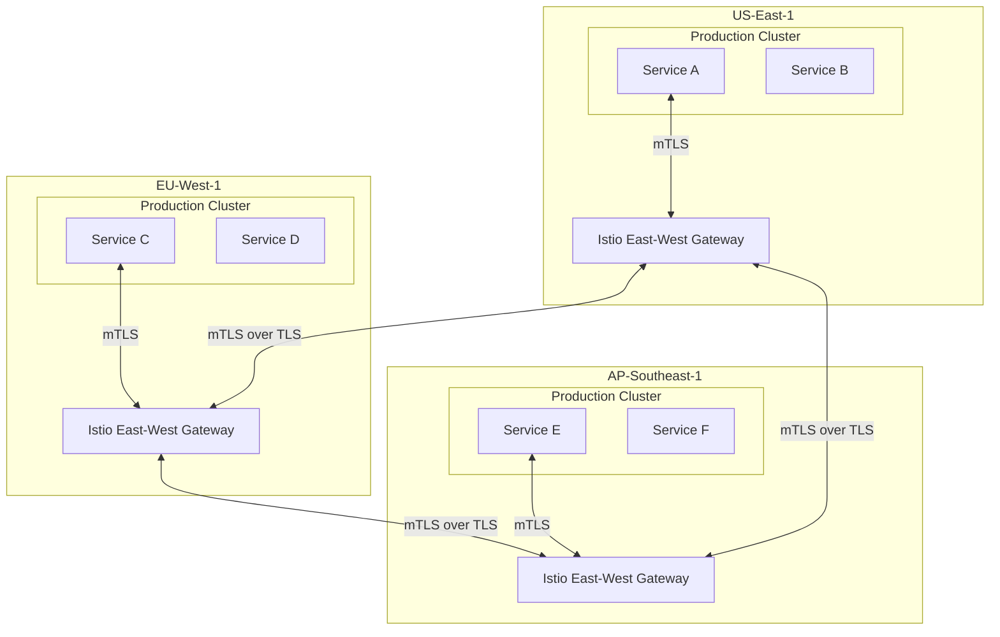

# EKS Comprehensive Platform Guide

This page serves as a comprehensive reference for deploying, configuring, and operating Amazon Elastic Kubernetes Service (EKS) clusters within our enterprise platform. It is intentionally feature-rich to showcase the full capabilities of the documentation platform.

---

## Table of Contents

This page covers:

- Cluster Architecture & Design
- Installation across multiple clouds and languages
- Networking deep-dive
- Security hardening
- Monitoring & Observability
- CI/CD Integration
- Troubleshooting runbooks
- API Reference
- Migration guides

---

## Cluster Architecture Overview

Our EKS platform follows a hub-and-spoke architecture where a central management cluster orchestrates workload clusters across multiple AWS regions. Each workload cluster is provisioned with Terraform modules maintained by the platform team.

### High-Level Architecture



### Component Responsibilities

| Component | Role | Owner |
|-----------|------|-------|
| ArgoCD | GitOps continuous delivery | Platform Team |
| Crossplane | Infrastructure-as-Code reconciliation | Platform Team |
| HashiCorp Vault | Secrets management & PKI | Security Team |
| Istio | Service mesh, mTLS, traffic management | Platform Team |
| Prometheus + Grafana | Metrics collection & dashboarding | Observability Team |
| Fluent Bit | Log forwarding to centralized ELK stack | Observability Team |
| Kyverno | Policy enforcement & admission control | Security Team |
| Cert-Manager | Automated TLS certificate lifecycle | Platform Team |
| External DNS | Automatic DNS record management | Platform Team |
| AWS Load Balancer Controller | Ingress & NLB provisioning | Platform Team |

### Node Group Topology



Each node group uses a dedicated IAM role, launch template, and autoscaling policy. The system node group runs on `m6i.large` instances, general workloads on `m6i.xlarge`, high-memory on `r6i.2xlarge`, and GPU nodes on `p3.2xlarge`.

---

## Installation & Setup

### Prerequisites

Before provisioning an EKS cluster, ensure the following tools are installed and configured.

=== "macOS"

    ```bash
    # Install Homebrew packages
    brew install awscli kubectl helm terraform

    # Install eksctl
    brew tap weaveworks/tap
    brew install weaveworks/tap/eksctl

    # Verify installations
    aws --version
    kubectl version --client
    helm version
    terraform version
    eksctl version
    ```

=== "Linux (Ubuntu/Debian)"

    ```bash
    # AWS CLI v2
    curl "https://awscli.amazonaws.com/awscli-exe-linux-x86_64.zip" -o "awscliv2.zip"
    unzip awscliv2.zip
    sudo ./aws/install

    # kubectl
    curl -LO "https://dl.k8s.io/release/$(curl -L -s https://dl.k8s.io/release/stable.txt)/bin/linux/amd64/kubectl"
    sudo install -o root -g root -m 0755 kubectl /usr/local/bin/kubectl

    # Helm
    curl https://raw.githubusercontent.com/helm/helm/main/scripts/get-helm-3 | bash

    # Terraform
    wget -O- https://apt.releases.hashicorp.com/gpg | sudo gpg --dearmor -o /usr/share/keyrings/hashicorp-archive-keyring.gpg
    echo "deb [signed-by=/usr/share/keyrings/hashicorp-archive-keyring.gpg] https://apt.releases.hashicorp.com $(lsb_release -cs) main" | sudo tee /etc/apt/sources.list.d/hashicorp.list
    sudo apt update && sudo apt install terraform

    # eksctl
    ARCH=amd64
    PLATFORM=$(uname -s)_$ARCH
    curl -sLO "https://github.com/eksctl-io/eksctl/releases/latest/download/eksctl_$PLATFORM.tar.gz"
    tar -xzf eksctl_$PLATFORM.tar.gz -C /tmp && sudo mv /tmp/eksctl /usr/local/bin
    ```

=== "Windows (WSL2)"

    ```powershell
    # Inside WSL2 Ubuntu terminal
    sudo apt update && sudo apt upgrade -y

    # AWS CLI
    curl "https://awscli.amazonaws.com/awscli-exe-linux-x86_64.zip" -o "awscliv2.zip"
    unzip awscliv2.zip && sudo ./aws/install

    # kubectl
    curl -LO "https://dl.k8s.io/release/v1.29.0/bin/linux/amd64/kubectl"
    chmod +x kubectl && sudo mv kubectl /usr/local/bin/

    # Helm
    curl https://raw.githubusercontent.com/helm/helm/main/scripts/get-helm-3 | bash

    # Terraform
    wget -O- https://apt.releases.hashicorp.com/gpg | sudo gpg --dearmor -o /usr/share/keyrings/hashicorp-archive-keyring.gpg
    sudo apt install terraform

    # eksctl
    curl -sLO "https://github.com/eksctl-io/eksctl/releases/latest/download/eksctl_Linux_amd64.tar.gz"
    tar -xzf eksctl_Linux_amd64.tar.gz -C /tmp && sudo mv /tmp/eksctl /usr/local/bin
    ```

### AWS Account Configuration

```bash
# Configure AWS credentials
aws configure --profile eks-admin

# Set the profile for this session
export AWS_PROFILE=eks-admin

# Verify access
aws sts get-caller-identity
```

Expected output:

```json
{
    "UserId": "AIDACKCEVSQ6C2EXAMPLE",
    "Account": "123456789012",
    "Arn": "arn:aws:iam::123456789012:user/eks-admin"
}
```

### Terraform Module Configuration

Our standard EKS module supports the following variables:

```hcl
module "eks_cluster" {
  source = "git::https://github.com/org/terraform-aws-eks.git?ref=v5.2.0"

  # Cluster Configuration
  cluster_name    = "prod-us-east-1"
  cluster_version = "1.29"
  
  # Networking
  vpc_id     = module.vpc.vpc_id
  subnet_ids = module.vpc.private_subnets
  
  # Node Groups
  managed_node_groups = {
    system = {
      instance_types = ["m6i.large"]
      min_size       = 2
      max_size       = 4
      desired_size   = 3
      labels = {
        "node-role" = "system"
      }
      taints = [{
        key    = "CriticalAddonsOnly"
        value  = "true"
        effect = "NO_SCHEDULE"
      }]
    }

    general = {
      instance_types = ["m6i.xlarge"]
      min_size       = 3
      max_size       = 20
      desired_size   = 5
      labels = {
        "node-role" = "general"
      }
    }

    highmem = {
      instance_types = ["r6i.2xlarge"]
      min_size       = 0
      max_size       = 10
      desired_size   = 2
      labels = {
        "node-role" = "highmem"
      }
      taints = [{
        key    = "workload-type"
        value  = "highmem"
        effect = "NO_SCHEDULE"
      }]
    }

    gpu = {
      instance_types = ["p3.2xlarge"]
      min_size       = 0
      max_size       = 5
      desired_size   = 0
      ami_type       = "AL2_x86_64_GPU"
      labels = {
        "node-role"        = "gpu"
        "nvidia.com/gpu"   = "true"
      }
      taints = [{
        key    = "nvidia.com/gpu"
        value  = "true"
        effect = "NO_SCHEDULE"
      }]
    }
  }

  # Add-ons
  cluster_addons = {
    coredns = {
      most_recent = true
    }
    kube-proxy = {
      most_recent = true
    }
    vpc-cni = {
      most_recent              = true
      service_account_role_arn = module.vpc_cni_irsa.iam_role_arn
      configuration_values = jsonencode({
        env = {
          ENABLE_PREFIX_DELEGATION = "true"
          WARM_PREFIX_TARGET       = "1"
        }
      })
    }
  }

  # Tags
  tags = {
    Environment = "production"
    Team        = "platform"
    ManagedBy   = "terraform"
  }
}
```

### Provisioning the Cluster

=== "Using Terraform"

    ```bash
    # Initialize Terraform
    cd infrastructure/eks
    terraform init -backend-config=backends/prod.hcl

    # Plan the deployment
    terraform plan -var-file=environments/prod.tfvars -out=plan.out

    # Review the plan carefully
    terraform show plan.out

    # Apply the configuration
    terraform apply plan.out

    # Configure kubectl
    aws eks update-kubeconfig --name prod-us-east-1 --region us-east-1
    ```

=== "Using eksctl"

    ```yaml
    # cluster-config.yaml
    apiVersion: eksctl.io/v1alpha5
    kind: ClusterConfig

    metadata:
      name: prod-us-east-1
      region: us-east-1
      version: "1.29"

    vpc:
      id: "vpc-0abc123def456"
      subnets:
        private:
          us-east-1a: { id: "subnet-0abc123" }
          us-east-1b: { id: "subnet-0def456" }
          us-east-1c: { id: "subnet-0ghi789" }

    managedNodeGroups:
      - name: system
        instanceType: m6i.large
        minSize: 2
        maxSize: 4
        desiredCapacity: 3
        labels:
          node-role: system
        taints:
          - key: CriticalAddonsOnly
            value: "true"
            effect: NoSchedule

      - name: general
        instanceType: m6i.xlarge
        minSize: 3
        maxSize: 20
        desiredCapacity: 5
        labels:
          node-role: general
    ```

    ```bash
    # Create the cluster
    eksctl create cluster -f cluster-config.yaml

    # Verify
    kubectl get nodes
    ```

=== "Using Crossplane"

    ```yaml
    apiVersion: eks.aws.crossplane.io/v1beta1
    kind: Cluster
    metadata:
      name: prod-us-east-1
    spec:
      forProvider:
        region: us-east-1
        version: "1.29"
        roleArnRef:
          name: eks-cluster-role
        resourcesVpcConfig:
          subnetIdRefs:
            - name: private-subnet-1a
            - name: private-subnet-1b
            - name: private-subnet-1c
          endpointPrivateAccess: true
          endpointPublicAccess: false
      providerConfigRef:
        name: aws-provider
    ```

    ```bash
    # Apply the Crossplane manifest
    kubectl apply -f crossplane/eks-cluster.yaml

    # Watch provisioning status
    kubectl get cluster.eks prod-us-east-1 -w
    ```

---

## Networking

### VPC Architecture

The networking layer is designed for high availability, security isolation, and optimal pod-to-service communication.



### Pod Networking with VPC CNI

AWS VPC CNI assigns real VPC IP addresses to pods, enabling native VPC networking without overlays.

```bash
# Check VPC CNI configuration
kubectl describe daemonset aws-node -n kube-system

# Verify prefix delegation is enabled
kubectl get ds aws-node -n kube-system -o jsonpath='{.spec.template.spec.containers[0].env}' | jq .

# Check IP allocation on a node
kubectl get node ip-10-0-10-42.ec2.internal -o jsonpath='{.status.allocatable.pods}'
```

### Network Policy Examples

=== "Allow Intra-Namespace"

    ```yaml
    apiVersion: networking.k8s.io/v1
    kind: NetworkPolicy
    metadata:
      name: allow-same-namespace
      namespace: production
    spec:
      podSelector: {}
      policyTypes:
        - Ingress
        - Egress
      ingress:
        - from:
            - podSelector: {}
      egress:
        - to:
            - podSelector: {}
        - to:
            - namespaceSelector:
                matchLabels:
                  kubernetes.io/metadata.name: kube-system
              podSelector:
                matchLabels:
                  k8s-app: kube-dns
            ports:
              - protocol: UDP
                port: 53
              - protocol: TCP
                port: 53
    ```

=== "Deny All External"

    ```yaml
    apiVersion: networking.k8s.io/v1
    kind: NetworkPolicy
    metadata:
      name: deny-all-external
      namespace: production
    spec:
      podSelector: {}
      policyTypes:
        - Ingress
        - Egress
      ingress: []
      egress:
        - to:
            - podSelector: {}
    ```

=== "Allow Specific Ingress"

    ```yaml
    apiVersion: networking.k8s.io/v1
    kind: NetworkPolicy
    metadata:
      name: allow-frontend-to-api
      namespace: production
    spec:
      podSelector:
        matchLabels:
          app: api-server
      policyTypes:
        - Ingress
      ingress:
        - from:
            - podSelector:
                matchLabels:
                  app: frontend
            - namespaceSelector:
                matchLabels:
                  environment: production
          ports:
            - protocol: TCP
              port: 8080
            - protocol: TCP
              port: 8443
    ```

### Ingress Configuration

=== "ALB Ingress"

    ```yaml
    apiVersion: networking.k8s.io/v1
    kind: Ingress
    metadata:
      name: app-ingress
      namespace: production
      annotations:
        kubernetes.io/ingress.class: alb
        alb.ingress.kubernetes.io/scheme: internet-facing
        alb.ingress.kubernetes.io/target-type: ip
        alb.ingress.kubernetes.io/certificate-arn: arn:aws:acm:us-east-1:123456789012:certificate/abc-123
        alb.ingress.kubernetes.io/ssl-policy: ELBSecurityPolicy-TLS13-1-2-2021-06
        alb.ingress.kubernetes.io/listen-ports: '[{"HTTPS":443}]'
        alb.ingress.kubernetes.io/ssl-redirect: "443"
        alb.ingress.kubernetes.io/healthcheck-path: /healthz
        alb.ingress.kubernetes.io/healthcheck-interval-seconds: "15"
        alb.ingress.kubernetes.io/healthcheck-timeout-seconds: "5"
        alb.ingress.kubernetes.io/healthy-threshold-count: "2"
        alb.ingress.kubernetes.io/unhealthy-threshold-count: "3"
    spec:
      rules:
        - host: app.example.com
          http:
            paths:
              - path: /api
                pathType: Prefix
                backend:
                  service:
                    name: api-service
                    port:
                      number: 8080
              - path: /
                pathType: Prefix
                backend:
                  service:
                    name: frontend-service
                    port:
                      number: 80
    ```

=== "NLB Ingress"

    ```yaml
    apiVersion: v1
    kind: Service
    metadata:
      name: nlb-service
      namespace: production
      annotations:
        service.beta.kubernetes.io/aws-load-balancer-type: external
        service.beta.kubernetes.io/aws-load-balancer-nlb-target-type: ip
        service.beta.kubernetes.io/aws-load-balancer-scheme: internet-facing
        service.beta.kubernetes.io/aws-load-balancer-cross-zone-load-balancing-enabled: "true"
        service.beta.kubernetes.io/aws-load-balancer-ssl-cert: arn:aws:acm:us-east-1:123456789012:certificate/abc-123
        service.beta.kubernetes.io/aws-load-balancer-ssl-ports: "443"
    spec:
      type: LoadBalancer
      selector:
        app: grpc-service
      ports:
        - name: grpc
          port: 443
          targetPort: 8443
          protocol: TCP
    ```

=== "Istio VirtualService"

    ```yaml
    apiVersion: networking.istio.io/v1beta1
    kind: VirtualService
    metadata:
      name: app-routing
      namespace: production
    spec:
      hosts:
        - app.example.com
      gateways:
        - istio-system/main-gateway
      http:
        - match:
            - uri:
                prefix: /api/v2
          route:
            - destination:
                host: api-v2
                port:
                  number: 8080
              weight: 90
            - destination:
                host: api-v3-canary
                port:
                  number: 8080
              weight: 10
          retries:
            attempts: 3
            perTryTimeout: 2s
            retryOn: gateway-error,connect-failure,refused-stream
        - match:
            - uri:
                prefix: /
          route:
            - destination:
                host: frontend
                port:
                  number: 80
    ```

---

## Security Hardening

### RBAC Configuration

Role-Based Access Control is critical for multi-tenant clusters. We define three tiers of access.



=== "Cluster Admin"

    ```yaml
    apiVersion: rbac.authorization.k8s.io/v1
    kind: ClusterRoleBinding
    metadata:
      name: platform-admins
    subjects:
      - kind: Group
        name: platform-admins
        apiGroup: rbac.authorization.k8s.io
    roleRef:
      kind: ClusterRole
      name: cluster-admin
      apiGroup: rbac.authorization.k8s.io
    ```

=== "Namespace Admin"

    ```yaml
    apiVersion: rbac.authorization.k8s.io/v1
    kind: Role
    metadata:
      name: namespace-admin
      namespace: team-alpha
    rules:
      - apiGroups: ["", "apps", "batch", "networking.k8s.io"]
        resources: ["*"]
        verbs: ["*"]
      - apiGroups: ["rbac.authorization.k8s.io"]
        resources: ["roles", "rolebindings"]
        verbs: ["get", "list", "watch"]
    ---
    apiVersion: rbac.authorization.k8s.io/v1
    kind: RoleBinding
    metadata:
      name: team-alpha-admins
      namespace: team-alpha
    subjects:
      - kind: Group
        name: team-alpha-admins
        apiGroup: rbac.authorization.k8s.io
    roleRef:
      kind: Role
      name: namespace-admin
      apiGroup: rbac.authorization.k8s.io
    ```

=== "Developer"

    ```yaml
    apiVersion: rbac.authorization.k8s.io/v1
    kind: Role
    metadata:
      name: developer
      namespace: team-alpha
    rules:
      - apiGroups: ["apps"]
        resources: ["deployments", "replicasets"]
        verbs: ["get", "list", "watch", "create", "update", "patch"]
      - apiGroups: [""]
        resources: ["pods", "pods/log", "services", "configmaps"]
        verbs: ["get", "list", "watch"]
      - apiGroups: [""]
        resources: ["pods/exec"]
        verbs: ["create"]
      - apiGroups: ["batch"]
        resources: ["jobs", "cronjobs"]
        verbs: ["get", "list", "watch", "create", "delete"]
    ```

### Pod Security Standards

```yaml
apiVersion: v1
kind: Namespace
metadata:
  name: production
  labels:
    pod-security.kubernetes.io/enforce: restricted
    pod-security.kubernetes.io/audit: restricted
    pod-security.kubernetes.io/warn: restricted
```

### Kyverno Policies

=== "Require Labels"

    ```yaml
    apiVersion: kyverno.io/v1
    kind: ClusterPolicy
    metadata:
      name: require-labels
    spec:
      validationFailureAction: Enforce
      rules:
        - name: check-required-labels
          match:
            any:
              - resources:
                  kinds:
                    - Deployment
                    - StatefulSet
                    - DaemonSet
          validate:
            message: "Labels 'app.kubernetes.io/name', 'app.kubernetes.io/version', and 'app.kubernetes.io/managed-by' are required."
            pattern:
              metadata:
                labels:
                  app.kubernetes.io/name: "?*"
                  app.kubernetes.io/version: "?*"
                  app.kubernetes.io/managed-by: "?*"
    ```

=== "Disallow Privileged"

    ```yaml
    apiVersion: kyverno.io/v1
    kind: ClusterPolicy
    metadata:
      name: disallow-privileged-containers
    spec:
      validationFailureAction: Enforce
      rules:
        - name: deny-privileged
          match:
            any:
              - resources:
                  kinds:
                    - Pod
          validate:
            message: "Privileged containers are not allowed."
            pattern:
              spec:
                containers:
                  - securityContext:
                      privileged: "!true"
                initContainers:
                  - securityContext:
                      privileged: "!true"
    ```

=== "Restrict Registries"

    ```yaml
    apiVersion: kyverno.io/v1
    kind: ClusterPolicy
    metadata:
      name: restrict-image-registries
    spec:
      validationFailureAction: Enforce
      rules:
        - name: validate-registries
          match:
            any:
              - resources:
                  kinds:
                    - Pod
          validate:
            message: "Images must come from approved registries: 123456789012.dkr.ecr.us-east-1.amazonaws.com or ghcr.io/org"
            pattern:
              spec:
                containers:
                  - image: "123456789012.dkr.ecr.*.amazonaws.com/* | ghcr.io/org/*"
                =(initContainers):
                  - image: "123456789012.dkr.ecr.*.amazonaws.com/* | ghcr.io/org/*"
    ```

---

## Monitoring & Observability

### Observability Stack Architecture



### Prometheus ServiceMonitor

```yaml
apiVersion: monitoring.coreos.com/v1
kind: ServiceMonitor
metadata:
  name: app-metrics
  namespace: monitoring
  labels:
    release: prometheus
spec:
  selector:
    matchLabels:
      app.kubernetes.io/name: api-server
  namespaceSelector:
    matchNames:
      - production
  endpoints:
    - port: metrics
      interval: 15s
      path: /metrics
      scheme: https
      tlsConfig:
        insecureSkipVerify: false
        caFile: /etc/prometheus/secrets/ca.crt
      metricRelabelings:
        - sourceLabels: [__name__]
          regex: "go_.*"
          action: drop
```

### PrometheusRule Alerts

=== "Pod Alerts"

    ```yaml
    apiVersion: monitoring.coreos.com/v1
    kind: PrometheusRule
    metadata:
      name: pod-alerts
      namespace: monitoring
    spec:
      groups:
        - name: pod.rules
          rules:
            - alert: PodCrashLooping
              expr: rate(kube_pod_container_status_restarts_total[15m]) * 60 * 15 > 0
              for: 1h
              labels:
                severity: warning
              annotations:
                summary: "Pod {{ $labels.namespace }}/{{ $labels.pod }} is crash looping"
                description: "Pod has restarted {{ $value }} times in the last 15 minutes"
                runbook_url: "https://docs.internal/runbooks/pod-crashloop"

            - alert: PodNotReady
              expr: kube_pod_status_ready{condition="true"} == 0
              for: 15m
              labels:
                severity: critical
              annotations:
                summary: "Pod {{ $labels.namespace }}/{{ $labels.pod }} is not ready"
                description: "Pod has been in a non-ready state for more than 15 minutes"

            - alert: ContainerOOMKilled
              expr: kube_pod_container_status_last_terminated_reason{reason="OOMKilled"} > 0
              for: 0m
              labels:
                severity: warning
              annotations:
                summary: "Container {{ $labels.container }} in {{ $labels.namespace }}/{{ $labels.pod }} was OOM killed"
    ```

=== "Node Alerts"

    ```yaml
    apiVersion: monitoring.coreos.com/v1
    kind: PrometheusRule
    metadata:
      name: node-alerts
      namespace: monitoring
    spec:
      groups:
        - name: node.rules
          rules:
            - alert: NodeHighCPU
              expr: 100 - (avg by(instance) (rate(node_cpu_seconds_total{mode="idle"}[5m])) * 100) > 85
              for: 10m
              labels:
                severity: warning
              annotations:
                summary: "Node {{ $labels.instance }} has high CPU usage ({{ $value }}%)"

            - alert: NodeHighMemory
              expr: (1 - (node_memory_MemAvailable_bytes / node_memory_MemTotal_bytes)) * 100 > 90
              for: 10m
              labels:
                severity: critical
              annotations:
                summary: "Node {{ $labels.instance }} memory usage is above 90% ({{ $value }}%)"

            - alert: NodeDiskPressure
              expr: (1 - (node_filesystem_avail_bytes{mountpoint="/"} / node_filesystem_size_bytes{mountpoint="/"})) * 100 > 85
              for: 5m
              labels:
                severity: warning
              annotations:
                summary: "Node {{ $labels.instance }} disk usage is above 85%"

            - alert: NodeNotReady
              expr: kube_node_status_condition{condition="Ready",status="true"} == 0
              for: 5m
              labels:
                severity: critical
              annotations:
                summary: "Node {{ $labels.node }} is not ready"
    ```

=== "Cluster Alerts"

    ```yaml
    apiVersion: monitoring.coreos.com/v1
    kind: PrometheusRule
    metadata:
      name: cluster-alerts
      namespace: monitoring
    spec:
      groups:
        - name: cluster.rules
          rules:
            - alert: ClusterHighPodCount
              expr: sum(kube_pod_info) / sum(kube_node_status_allocatable{resource="pods"}) * 100 > 80
              for: 15m
              labels:
                severity: warning
              annotations:
                summary: "Cluster pod capacity is above 80%"

            - alert: PersistentVolumeNearFull
              expr: kubelet_volume_stats_used_bytes / kubelet_volume_stats_capacity_bytes * 100 > 85
              for: 10m
              labels:
                severity: warning
              annotations:
                summary: "PVC {{ $labels.persistentvolumeclaim }} in {{ $labels.namespace }} is {{ $value }}% full"

            - alert: APIServerLatencyHigh
              expr: histogram_quantile(0.99, sum(rate(apiserver_request_duration_seconds_bucket{verb!="WATCH"}[5m])) by (verb, le)) > 1
              for: 10m
              labels:
                severity: warning
              annotations:
                summary: "API server 99th percentile latency is above 1 second for {{ $labels.verb }} requests"
    ```

### Logging with Fluent Bit

```yaml
apiVersion: v1
kind: ConfigMap
metadata:
  name: fluent-bit-config
  namespace: logging
data:
  fluent-bit.conf: |
    [SERVICE]
        Flush         5
        Log_Level     info
        Daemon        off
        Parsers_File  parsers.conf

    [INPUT]
        Name              tail
        Tag               kube.*
        Path              /var/log/containers/*.log
        Parser            cri
        DB                /var/log/flb_kube.db
        Mem_Buf_Limit     50MB
        Skip_Long_Lines   On
        Refresh_Interval  10

    [FILTER]
        Name                kubernetes
        Match               kube.*
        Kube_URL            https://kubernetes.default.svc:443
        Kube_CA_File        /var/run/secrets/kubernetes.io/serviceaccount/ca.crt
        Kube_Token_File     /var/run/secrets/kubernetes.io/serviceaccount/token
        Merge_Log           On
        Keep_Log            Off
        K8S-Logging.Parser  On
        K8S-Logging.Exclude On

    [OUTPUT]
        Name            es
        Match           kube.*
        Host            elasticsearch.logging.svc.cluster.local
        Port            9200
        Index           kubernetes-logs
        Type            _doc
        Logstash_Format On
        Logstash_Prefix kubernetes
        Retry_Limit     5
        tls             On
        tls.verify      Off
```

---

## CI/CD Integration

### GitOps Deployment Flow



### GitHub Actions Workflow

```yaml
name: Build and Deploy
on:
  push:
    branches: [main]
  pull_request:
    branches: [main]

env:
  AWS_REGION: us-east-1
  ECR_REGISTRY: 123456789012.dkr.ecr.us-east-1.amazonaws.com
  IMAGE_NAME: api-server

jobs:
  test:
    runs-on: ubuntu-latest
    steps:
      - uses: actions/checkout@v4
      - uses: actions/setup-node@v4
        with:
          node-version: "20"
          cache: "npm"
      - run: npm ci
      - run: npm run lint
      - run: npm run test -- --coverage
      - uses: actions/upload-artifact@v4
        with:
          name: coverage
          path: coverage/

  build:
    needs: test
    if: github.ref == 'refs/heads/main'
    runs-on: ubuntu-latest
    permissions:
      id-token: write
      contents: read
    steps:
      - uses: actions/checkout@v4

      - uses: aws-actions/configure-aws-credentials@v4
        with:
          role-to-assume: arn:aws:iam::123456789012:role/github-actions-ecr
          aws-region: ${{ env.AWS_REGION }}

      - uses: aws-actions/amazon-ecr-login@v2
        id: login-ecr

      - name: Build and push image
        run: |
          IMAGE_TAG="${{ github.sha }}"
          docker build -t $ECR_REGISTRY/$IMAGE_NAME:$IMAGE_TAG .
          docker push $ECR_REGISTRY/$IMAGE_NAME:$IMAGE_TAG

      - name: Update manifests
        run: |
          cd manifests
          kustomize edit set image $ECR_REGISTRY/$IMAGE_NAME=$ECR_REGISTRY/$IMAGE_NAME:${{ github.sha }}
          git add .
          git commit -m "chore: update image to ${{ github.sha }}"
          git push

  deploy-staging:
    needs: build
    runs-on: ubuntu-latest
    environment: staging
    steps:
      - name: Trigger ArgoCD Sync
        run: |
          argocd app sync api-server-staging --grpc-web --auth-token ${{ secrets.ARGOCD_TOKEN }}
          argocd app wait api-server-staging --grpc-web --auth-token ${{ secrets.ARGOCD_TOKEN }}
```

### ArgoCD Application

```yaml
apiVersion: argoproj.io/v1alpha1
kind: Application
metadata:
  name: api-server-production
  namespace: argocd
spec:
  project: production
  source:
    repoURL: https://github.com/org/k8s-manifests.git
    targetRevision: main
    path: apps/api-server/overlays/production
  destination:
    server: https://kubernetes.default.svc
    namespace: production
  syncPolicy:
    automated:
      prune: true
      selfHeal: true
    syncOptions:
      - CreateNamespace=true
      - ApplyOutOfSyncOnly=true
    retry:
      limit: 5
      backoff:
        duration: 5s
        factor: 2
        maxDuration: 3m
  ignoreDifferences:
    - group: apps
      kind: Deployment
      jsonPointers:
        - /spec/replicas
```

---

## Scaling & Performance

### Horizontal Pod Autoscaler

=== "CPU Based"

    ```yaml
    apiVersion: autoscaling/v2
    kind: HorizontalPodAutoscaler
    metadata:
      name: api-server-hpa
      namespace: production
    spec:
      scaleTargetRef:
        apiVersion: apps/v1
        kind: Deployment
        name: api-server
      minReplicas: 3
      maxReplicas: 50
      metrics:
        - type: Resource
          resource:
            name: cpu
            target:
              type: Utilization
              averageUtilization: 70
        - type: Resource
          resource:
            name: memory
            target:
              type: Utilization
              averageUtilization: 80
      behavior:
        scaleUp:
          stabilizationWindowSeconds: 60
          policies:
            - type: Pods
              value: 4
              periodSeconds: 60
            - type: Percent
              value: 100
              periodSeconds: 60
          selectPolicy: Max
        scaleDown:
          stabilizationWindowSeconds: 300
          policies:
            - type: Pods
              value: 1
              periodSeconds: 300
    ```

=== "Custom Metrics"

    ```yaml
    apiVersion: autoscaling/v2
    kind: HorizontalPodAutoscaler
    metadata:
      name: queue-worker-hpa
      namespace: production
    spec:
      scaleTargetRef:
        apiVersion: apps/v1
        kind: Deployment
        name: queue-worker
      minReplicas: 2
      maxReplicas: 100
      metrics:
        - type: Object
          object:
            describedObject:
              apiVersion: v1
              kind: Service
              name: rabbitmq
            metric:
              name: rabbitmq_queue_messages_ready
            target:
              type: Value
              value: "50"
        - type: Pods
          pods:
            metric:
              name: http_requests_per_second
            target:
              type: AverageValue
              averageValue: "1000"
    ```

=== "KEDA Scaler"

    ```yaml
    apiVersion: keda.sh/v1alpha1
    kind: ScaledObject
    metadata:
      name: sqs-worker
      namespace: production
    spec:
      scaleTargetRef:
        name: sqs-worker
      pollingInterval: 15
      cooldownPeriod: 120
      idleReplicaCount: 0
      minReplicaCount: 1
      maxReplicaCount: 200
      triggers:
        - type: aws-sqs-queue
          metadata:
            queueURL: https://sqs.us-east-1.amazonaws.com/123456789012/processing-queue
            queueLength: "5"
            awsRegion: us-east-1
          authenticationRef:
            name: keda-aws-credentials
    ```

### Cluster Autoscaler vs Karpenter

| Feature | Cluster Autoscaler | Karpenter |
|---------|-------------------|-----------|
| Scaling Speed | 2-5 minutes | 30-60 seconds |
| Instance Selection | Pre-defined node groups | Dynamic, bin-packing |
| Spot Support | Via node groups | Native, flexible |
| Configuration | Per-ASG settings | Provisioner CRDs |
| Cost Optimization | Manual | Automatic consolidation |
| ARM64 Support | Separate node groups | Automatic selection |
| Maintenance | High | Low |

```yaml
# Karpenter Provisioner
apiVersion: karpenter.sh/v1alpha5
kind: Provisioner
metadata:
  name: default
spec:
  requirements:
    - key: karpenter.sh/capacity-type
      operator: In
      values: ["on-demand", "spot"]
    - key: node.kubernetes.io/instance-type
      operator: In
      values:
        - m6i.large
        - m6i.xlarge
        - m6i.2xlarge
        - c6i.large
        - c6i.xlarge
        - c6i.2xlarge
        - r6i.large
        - r6i.xlarge
    - key: topology.kubernetes.io/zone
      operator: In
      values:
        - us-east-1a
        - us-east-1b
        - us-east-1c
  limits:
    resources:
      cpu: 1000
      memory: 2000Gi
  ttlSecondsAfterEmpty: 60
  ttlSecondsUntilExpired: 2592000
  consolidation:
    enabled: true
  providerRef:
    name: default
```

---

## Troubleshooting Guide

### Common Issues & Solutions

#### Pod Stuck in Pending State

```bash
# Check events for the pod
kubectl describe pod <pod-name> -n <namespace>

# Common causes and solutions:
# 1. Insufficient resources
kubectl top nodes
kubectl describe node <node-name> | grep -A 10 "Allocated resources"

# 2. Node selector / affinity mismatch
kubectl get nodes --show-labels | grep <expected-label>

# 3. Taints preventing scheduling
kubectl describe nodes | grep -A 3 "Taints"

# 4. PVC not bound
kubectl get pvc -n <namespace>
kubectl describe pvc <pvc-name> -n <namespace>
```

#### ImagePullBackOff

```bash
# Check pod events
kubectl describe pod <pod-name> -n <namespace> | grep -A 5 "Events"

# Verify ECR authentication
aws ecr get-login-password --region us-east-1 | docker login --username AWS --password-stdin 123456789012.dkr.ecr.us-east-1.amazonaws.com

# Check if the image exists
aws ecr describe-images --repository-name <repo-name> --image-ids imageTag=<tag>

# Verify IRSA configuration for ECR access
kubectl describe sa <service-account> -n <namespace>
```

#### Node Not Ready

```bash
# Check node conditions
kubectl describe node <node-name> | grep -A 20 "Conditions"

# SSH into the node and check kubelet
ssh ec2-user@<node-ip>
sudo systemctl status kubelet
sudo journalctl -u kubelet -f --no-pager | tail -100

# Check disk pressure
df -h /
df -h /var/lib/kubelet
df -h /var/lib/containerd

# Check memory pressure
free -h
cat /proc/meminfo | head -5

# Check network connectivity
curl -k https://kubernetes.default.svc/healthz
```

### Diagnostic Scripts

=== "Cluster Health Check"

    ```bash
    #!/bin/bash
    # cluster-health.sh — Run a comprehensive health check

    echo "=== Cluster Info ==="
    kubectl cluster-info

    echo ""
    echo "=== Node Status ==="
    kubectl get nodes -o wide

    echo ""
    echo "=== Node Resource Usage ==="
    kubectl top nodes

    echo ""
    echo "=== System Pods ==="
    kubectl get pods -n kube-system -o wide

    echo ""
    echo "=== Pods Not Running ==="
    kubectl get pods --all-namespaces --field-selector=status.phase!=Running,status.phase!=Succeeded

    echo ""
    echo "=== Recent Events (Warnings) ==="
    kubectl get events --all-namespaces --sort-by='.lastTimestamp' --field-selector type=Warning | tail -20

    echo ""
    echo "=== PVCs Not Bound ==="
    kubectl get pvc --all-namespaces --field-selector=status.phase!=Bound

    echo ""
    echo "=== Deployments Not Ready ==="
    kubectl get deployments --all-namespaces | awk '$3 != $4 {print}'

    echo ""
    echo "=== HPA Status ==="
    kubectl get hpa --all-namespaces
    ```

=== "Resource Audit"

    ```bash
    #!/bin/bash
    # resource-audit.sh — Find over/under-provisioned workloads

    echo "=== Pods Without Resource Limits ==="
    kubectl get pods --all-namespaces -o json | jq -r '
      .items[] |
      select(.spec.containers[].resources.limits == null) |
      "\(.metadata.namespace)/\(.metadata.name)"
    '

    echo ""
    echo "=== Pods Without Resource Requests ==="
    kubectl get pods --all-namespaces -o json | jq -r '
      .items[] |
      select(.spec.containers[].resources.requests == null) |
      "\(.metadata.namespace)/\(.metadata.name)"
    '

    echo ""
    echo "=== Top 10 CPU Consumers ==="
    kubectl top pods --all-namespaces --sort-by=cpu | head -11

    echo ""
    echo "=== Top 10 Memory Consumers ==="
    kubectl top pods --all-namespaces --sort-by=memory | head -11

    echo ""
    echo "=== Unschedulable Nodes ==="
    kubectl get nodes -o json | jq -r '
      .items[] |
      select(.spec.unschedulable == true) |
      .metadata.name
    '
    ```

=== "Network Debug"

    ```bash
    #!/bin/bash
    # network-debug.sh — Diagnose networking issues

    echo "=== CoreDNS Status ==="
    kubectl get pods -n kube-system -l k8s-app=kube-dns

    echo ""
    echo "=== DNS Resolution Test ==="
    kubectl run dns-test --rm -i --restart=Never --image=busybox -- nslookup kubernetes.default

    echo ""
    echo "=== VPC CNI Status ==="
    kubectl get ds aws-node -n kube-system
    kubectl logs -n kube-system -l k8s-app=aws-node --tail=20

    echo ""
    echo "=== Network Policies ==="
    kubectl get networkpolicies --all-namespaces

    echo ""
    echo "=== Services Without Endpoints ==="
    kubectl get endpoints --all-namespaces | awk '$2 == "" || $2 == "<none>" {print}'

    echo ""
    echo "=== Ingress Status ==="
    kubectl get ingress --all-namespaces

    echo ""
    echo "=== Load Balancers ==="
    kubectl get svc --all-namespaces -o json | jq -r '
      .items[] |
      select(.spec.type == "LoadBalancer") |
      "\(.metadata.namespace)/\(.metadata.name): \(.status.loadBalancer.ingress[0].hostname // "PENDING")"
    '
    ```

---

## Disaster Recovery

### Backup Strategy



### Velero Configuration

```yaml
apiVersion: velero.io/v1
kind: Schedule
metadata:
  name: daily-backup
  namespace: velero
spec:
  schedule: "0 2 * * *"
  template:
    includedNamespaces:
      - production
      - staging
    excludedResources:
      - events
      - events.events.k8s.io
    snapshotVolumes: true
    storageLocation: aws-s3-backup
    volumeSnapshotLocations:
      - aws-ebs-snapshots
    ttl: 720h0m0s
    labelSelector:
      matchExpressions:
        - key: "velero.io/exclude"
          operator: DoesNotExist
  useOwnerReferencesInBackup: false
```

```bash
# Manual backup before major changes
velero backup create pre-upgrade-$(date +%Y%m%d) \
  --include-namespaces production \
  --snapshot-volumes \
  --wait

# List backups
velero backup get

# Restore from backup
velero restore create --from-backup daily-backup-20240115020000 \
  --include-namespaces production \
  --restore-volumes
```

### RTO / RPO Targets

| Tier | Recovery Point Objective | Recovery Time Objective | Backup Frequency |
|------|--------------------------|-------------------------|-------------------|
| Tier 1 (Critical) | 1 hour | 15 minutes | Every hour |
| Tier 2 (Important) | 4 hours | 1 hour | Every 4 hours |
| Tier 3 (Standard) | 24 hours | 4 hours | Daily |
| Tier 4 (Development) | 7 days | 24 hours | Weekly |

---

## Cost Optimization

### Resource Right-Sizing

We use the Vertical Pod Autoscaler (VPA) in recommendation mode to identify over-provisioned workloads.

```yaml
apiVersion: autoscaling.k8s.io/v1
kind: VerticalPodAutoscaler
metadata:
  name: api-server-vpa
  namespace: production
spec:
  targetRef:
    apiVersion: apps/v1
    kind: Deployment
    name: api-server
  updatePolicy:
    updateMode: "Off"
  resourcePolicy:
    containerPolicies:
      - containerName: api-server
        minAllowed:
          cpu: 100m
          memory: 128Mi
        maxAllowed:
          cpu: 4
          memory: 8Gi
```

```bash
# Get VPA recommendations
kubectl describe vpa api-server-vpa -n production

# Output example:
# Recommendation:
#   Container Recommendations:
#     Container Name: api-server
#     Lower Bound:    Cpu: 250m,  Memory: 512Mi
#     Target:         Cpu: 500m,  Memory: 1Gi
#     Upper Bound:    Cpu: 1,     Memory: 2Gi
```

### Spot Instance Strategy

| Workload Type | Instance Strategy | Spot Percentage | Fallback |
|---------------|-------------------|-----------------|----------|
| Stateless APIs | Mixed (on-demand + spot) | 70% | On-demand |
| Batch Jobs | Spot only | 100% | Queue retry |
| Cron Jobs | Spot preferred | 90% | On-demand |
| Databases | On-demand only | 0% | N/A |
| CI Runners | Spot only | 100% | Cloud-hosted |

---

## Multi-Cluster Federation

### Service Mesh Federation



### Cross-Cluster Service Discovery

```yaml
apiVersion: networking.istio.io/v1alpha3
kind: ServiceEntry
metadata:
  name: api-server-eu
  namespace: production
spec:
  hosts:
    - api-server.production.eu-west-1.mesh
  location: MESH_INTERNAL
  ports:
    - number: 8080
      name: http
      protocol: HTTP
  resolution: DNS
  endpoints:
    - address: api-server.production.svc.cluster.local
      network: eu-west-1
      locality: eu-west-1/eu-west-1a
      ports:
        http: 8080
```

---

## Appendix

### Useful kubectl Commands

```bash
# Get all resources in a namespace
kubectl get all -n production

# Watch pod status changes
kubectl get pods -n production -w

# Get pod resource usage
kubectl top pods -n production --sort-by=memory

# Get pod logs (last 100 lines, follow)
kubectl logs -f --tail=100 -n production deployment/api-server

# Execute into a running pod
kubectl exec -it -n production deployment/api-server -- /bin/sh

# Port forward to a service
kubectl port-forward -n production svc/api-server 8080:8080

# Get events sorted by time
kubectl get events -n production --sort-by='.lastTimestamp'

# Drain a node for maintenance
kubectl drain <node-name> --ignore-daemonsets --delete-emptydir-data

# Uncordon a node after maintenance
kubectl uncordon <node-name>

# Force delete a stuck pod
kubectl delete pod <pod-name> -n <namespace> --force --grace-period=0

# Get all images running in the cluster
kubectl get pods --all-namespaces -o jsonpath='{range .items[*]}{range .spec.containers[*]}{.image}{"\n"}{end}{end}' | sort -u

# Check RBAC permissions
kubectl auth can-i --list --as=system:serviceaccount:production:api-server

# Get cluster resource quotas
kubectl describe resourcequota -n production

# Compare two deployments
kubectl diff -f deployment.yaml
```

### Environment Variables Reference

| Variable | Description | Default | Required |
|----------|-------------|---------|----------|
| `AWS_REGION` | AWS region for the cluster | `us-east-1` | Yes |
| `CLUSTER_NAME` | Name of the EKS cluster | — | Yes |
| `CLUSTER_VERSION` | Kubernetes version | `1.29` | Yes |
| `VPC_CIDR` | VPC CIDR block | `10.0.0.0/16` | Yes |
| `NODE_INSTANCE_TYPE` | Default instance type | `m6i.xlarge` | No |
| `MIN_NODES` | Minimum nodes per group | `2` | No |
| `MAX_NODES` | Maximum nodes per group | `20` | No |
| `ENABLE_SPOT` | Enable spot instances | `false` | No |
| `SPOT_PERCENTAGE` | Percentage of spot instances | `0` | No |
| `ENABLE_GPU` | Enable GPU node group | `false` | No |
| `LOG_LEVEL` | Application log level | `info` | No |
| `METRICS_PORT` | Prometheus metrics port | `9090` | No |
| `HEALTH_CHECK_PATH` | Health check endpoint | `/healthz` | No |
| `READY_CHECK_PATH` | Readiness check endpoint | `/readyz` | No |
| `GRACEFUL_SHUTDOWN_TIMEOUT` | Shutdown timeout in seconds | `30` | No |
| `MAX_REQUEST_BODY_SIZE` | Max request body size | `10MB` | No |
| `DB_CONNECTION_POOL_SIZE` | Database connection pool | `20` | No |
| `CACHE_TTL_SECONDS` | Cache TTL | `300` | No |
| `RATE_LIMIT_RPS` | Rate limit (requests/second) | `100` | No |
| `CORS_ALLOWED_ORIGINS` | CORS allowed origins | `*` | No |

### Terraform Module Version History

| Version | Release Date | Key Changes |
|---------|-------------|-------------|
| v5.2.0 | 2024-12-15 | Added Karpenter support, VPC prefix delegation |
| v5.1.0 | 2024-10-01 | Kubernetes 1.29 support, enhanced monitoring |
| v5.0.0 | 2024-07-15 | **Breaking:** Migrated to IRSA v2, dropped IMDSv1 |
| v4.3.0 | 2024-05-01 | Istio 1.20 integration, cert-manager v1.14 |
| v4.2.0 | 2024-03-01 | Kyverno policy engine, OPA deprecated |
| v4.1.0 | 2024-01-15 | Spot instance support, multi-AZ NAT gateways |
| v4.0.0 | 2023-11-01 | **Breaking:** Terraform 1.6 required, provider v5 |
| v3.5.0 | 2023-09-01 | Velero backup integration, cross-region replication |
| v3.4.0 | 2023-07-01 | External DNS, ALB controller managed add-ons |
| v3.3.0 | 2023-05-01 | Fluent Bit logging, Elasticsearch integration |
| v3.2.0 | 2023-03-01 | Prometheus + Grafana stack, alert rules |
| v3.1.0 | 2023-01-15 | Network policy enforcement, Calico CNI option |
| v3.0.0 | 2022-11-01 | **Breaking:** EKS Blueprints architecture rewrite |

---

*This document is maintained by the Platform Engineering team. Last updated: 2024-12-15. For questions, reach out on `#platform-support` Slack channel.*
